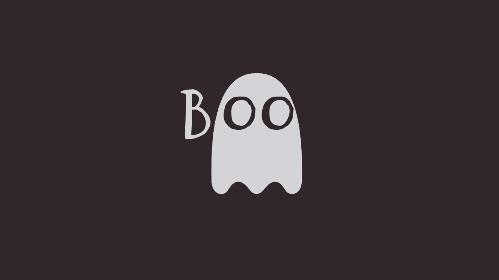

# Boo.js

Boo.js is a simple and minimalistic scroll animation library, which currently has 16 different animations.

[Go to page](https://cristian-velazquez-neva.github.io/boo.js/)

## Documentation

To be able to use this library, you must first use the name of the `Boo` class followed by the name of the animation you want to run.

This is a list of animation names that can be used:

- Top
- Bottom
- Left
- Right
- TopLeft
- TopRight
- BottomLeft
- BottomRight
- RotateX
- RotateY
- ZoomEx
- ZoomDi
- SkewTB
- SkewBT
- SkewRTB
- SkewRBT

The names of the animations refer to where they appear from or how they do it.

## Animation creator

Users can also create their own animations, just use the `Boo` class again and create a new class with the attributes `opacity: 0;`, `transition: 0.5s all ease-in-out;` and `transform: {value};` where value will be how the animation will be executed. Example `transform: scale(0.20, -1.20);`

## Nota

The animations appear and disappear depending on the distance they are from the screen length, so they will only work if the page layout is in portrait mode and the items are not at the top of the page when it is loaded.
